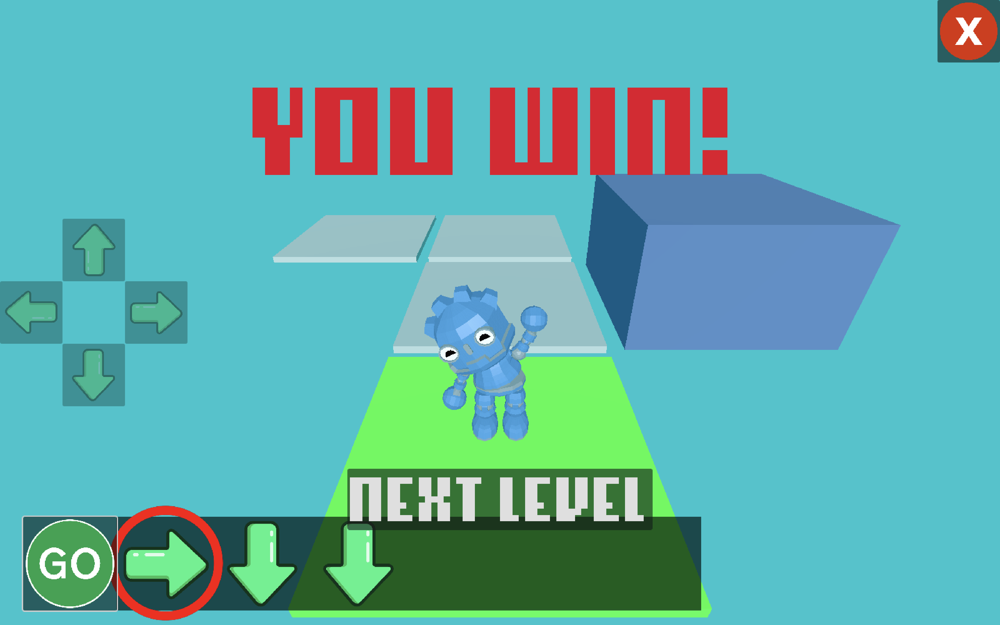
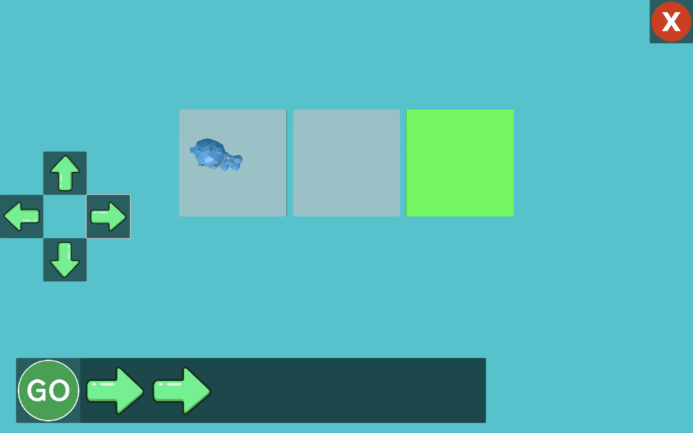
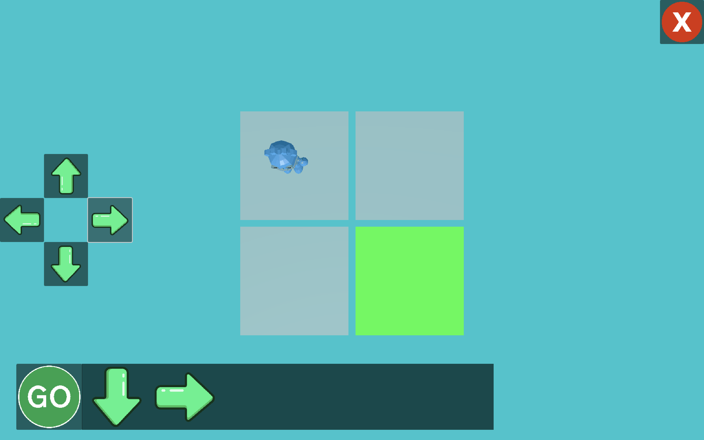
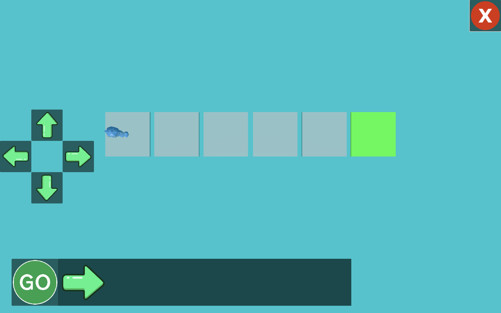
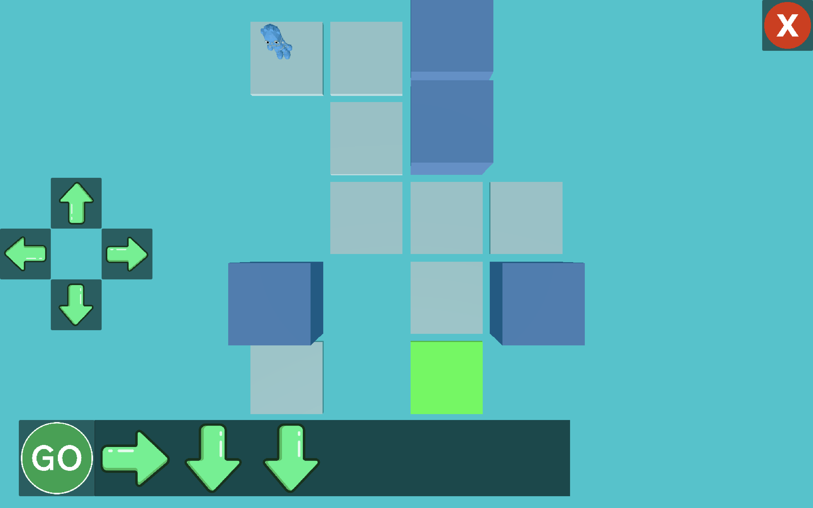
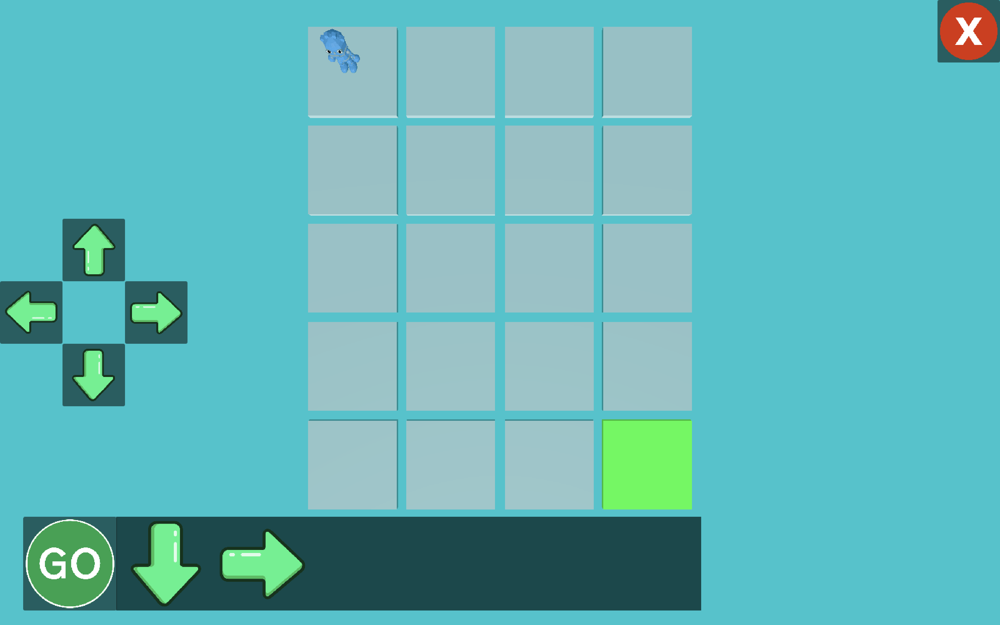
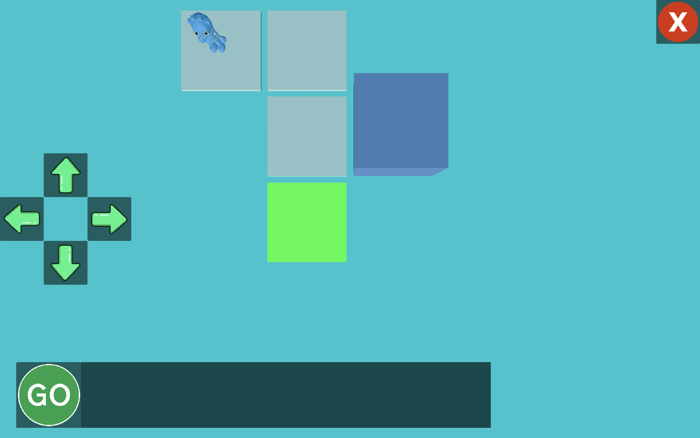
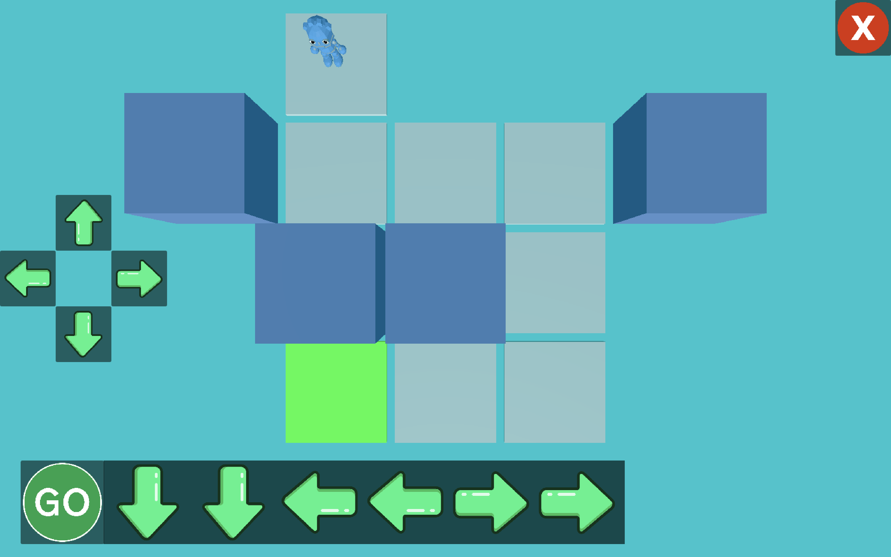

# Code-Bot

This is a simple Godot game to serve as an introduction into coding for children. Designed for a Pre-K class, but 
can be used for anyone as long as they know their lefts and rights.

Designed to be presented to a class, you can ask the kids what commands they would need to get to the green square,
and explain the reasoning for each step and the new concepts that come up in each level. See below for more details.

#### Disclaimer

This was made a few days before I was asked to teach the lesson, so the code is far from clean and it could
easily be improved. However it's not really a game the kids would play, more of a lesson.

## Gameplay

Each level the player is on a grid and needs to get to the green square. They are able to input 1 of 4 directions,
and only up to 6 commands total. If the player has not finished by the end of the inputs, the robot will go back
to the start of the inputs

# Lesson Plan

### Intro

To introduce this, explain that there is a robot and he needs to get to the green square. And inform them
of the following:

- You can add commands to the robot that are Up, Down, Left, and Right
- You can only do a total of 6 commands
- If the robot runs out of commands, he will start the commands over
- If the robot hits a wall, he will not go anywhere

## Levels

There are several solutions to each level, but the screenshots show at least one solution to the level. Then it 
includes a blurb about what to teach for that level.

### Level 1

This is an intro to the game, you should start by showing them that you can go to the right twice in this level.

### Level 2

This level can either be solved with (Right, Down) or (Down, Right). The aim of this lesson is to teach the kids
that the same problem can be solved in multiple different ways.

### Level 3

The goal of this level is to take advantage of the looping mechanic, where the commands will reset. Say something like
"Typing all these arrows is annoying, so if we just type 1, it will loop over the commands and do them over and
over".

### Level 4

The goal of  this level is to show a use for the looping mechanic. Where it's a little more complicated, but can
still be easily solved. Also other blocks are added as distractions. The solution we can do is (Right, Down, Down),
but you can also ask if they can see another solution and do (Right, Down), which will introduce the wall mechanic.

### Level 5

This level must be completed with looping, and (Down, Right) is the easiest solution to explain. If they try
all down then all right, it will be too many commands for the robot, and he will fall of the cliff. Might be
worth it to show by example.

### Level 6

This level also has walls, and if the robot runs into the walls he will end up not moving with a little
bonk animation and sound effect. The correct answer to this is shown and might be a little tough to explain.
You can of course do the obvious solution, but try to emphasize that you want to be clever to solve it.

### Level 7

This level is actually pretty confusing and I wouldn't be surprised if they couldn't get it. Meant for a final
challenge to the kids.

